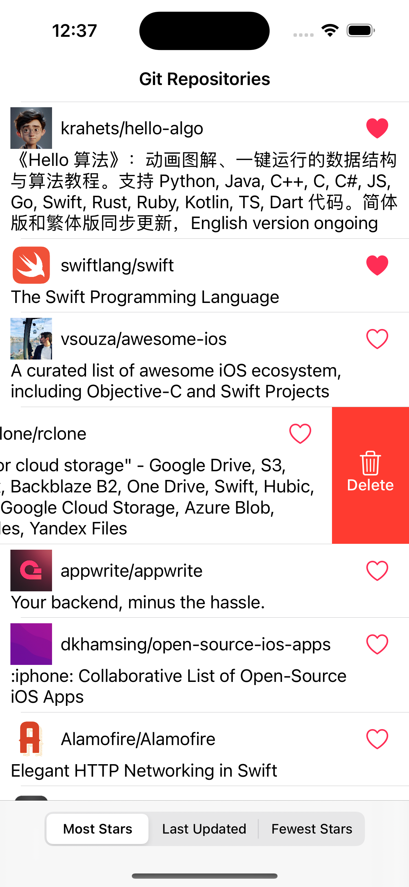

# GitReposApp

GitReposApp — это приложение, которое умеет брать данные репозиториев с ресурса Github и отображать списком с различными фильтрами. Этот проект создан в качестве тестового задания и 
предназначен для демонстрации моего накопленного опыта в разработке для платформы iOS.

## Особенности
- Данные с github.com
- Список репозиториев по ключу "Swift"
- Три доступных фильтра: Большинство отметок, Последнее добавленное, Самое малое количество отметок
- Возможность отмечать понравившиеся репозитории или скрывать их на своем устройстве

## Превью интерфейса
[Видео с демонстрацией возможностей](https://disk.yandex.ru/i/Z2Ip6aVu05zp-g)




## Стек

- UIKit
- Clean Architecture(MVVM и FlowCoordinator)
- Combine для реактивного программирования
- Realm для локального хранилища

## Установка

Чтобы установить и запустить проект, выполните следующие шаги:

1. Клонируйте репозиторий на свой локальный компьютер, используя команду:

    ```bash
    git clone https://github.com/deemoji/GitReposApp.git
    ```
2. Перейдите в директорию проекта:

    ```bash
    cd GitReposApp
    ```

3. Откройте проект в Xcode:

    ```bash
    open GitReposApp.xcodeproj
    ```

4. Нажмите кнопку "Run" (или используйте сочетание клавиш `Cmd + R`), чтобы собрать и запустить проект.
